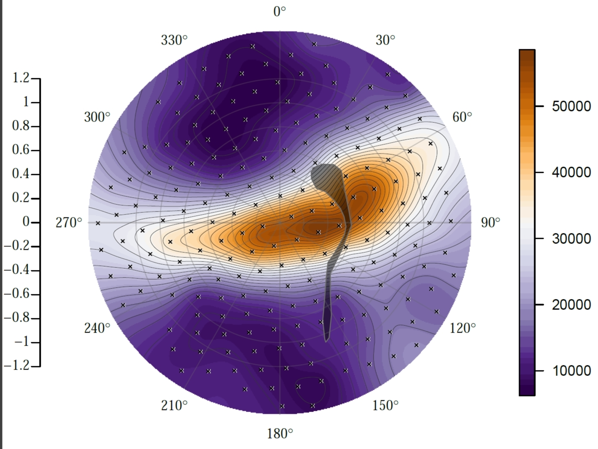

# 
[](https://travis-ci.org/bc/retina)
## The most quantitative way to compare and visualize retinal cell densities


After surveying cell density across the retina using a stereology-equipped microscope:

Use _retina_ to

```
  + Import retinal outline and sampling data
  + Reinstate the hemispherical shape of the data (1)
  + Make species average maps
  + Evaluate parameters and fit of smoothing models
  + Plot a contoured topographic heatmap
```


# [Install](install.md "Installation Page")
# [Tutorial](tutorial.md "Tutorial.md")

### Abstract
We believe the eye is a unique window into the evolutionary process.
But most scientists do not quantitatively compare the entire map between species. Why? Getting retinal data means flattening the retina onto a microscope slide, and re-stitching the data consistently across species is challenging.

### Project description
Biologists who study vision are fascinated by the retina, the rear surface of the eye which collects light and transmits an 'image' to the brain. Through evolution, eyes have been exceptionally diverse across the animal kingdom, yielding a wide variety of shapes, sizes, colors, and chemical processes. For this reason, the eye is often used to understand how complex traits evolve with ecology, the interactions of the animal with its environment. A retinal ganglion cell map helps biologists visualize receptive cells across the rear surface of the vertebrate eye. This topographic map shows density in a way which highlights areas of higher visual performance, and this can be used to understand what regions of an animal's visual field are most clear-in-view. For a human, we only have one point on the eye where things are clear- that's why we can really only see a few words at a time while reading, for example. Some fish have multiple centers of high visual performance, more formally referred to as a peak of retinal acuity.

### Detail
This project provides an accurate and rigorous tool for visualizing data from an animal's retina, the rear surface of the eye. In particular, our open-source package can be quickly installed by vision researchers worldwide using completely free software, to begin generating meaningful comparisons between different eyes. In the past, the most frequently used way to visualize data on the retina was to slice and flatten the retina onto a microscope slide, then present the data in that form. These _retinal maps_ can take several hours to construct by hand or with proprietary software, and have been the industry standard for over thirty five years, in hundreds of publications. With our software, a researcher can produce many maps in one hour, make consistent comparisons, and generate useful statistics. The software is also customizable to meet the user's specific requirements, as it is open-source. We hope our software will be useful for vision scientists and hope to receive feedback that results in further additions to the program.

#### Questions/Ideas/Help
[Post a github issue ticket (15 seconds)](https://github.com/bcohn12/retina/issues/new "Post an issue ticket")

#### Notes
1. Thank you to David Sterratt (Sterratt et. al. 2013) who designed and published the stitching algorithm that enabled this work. (GPL-2 License)
2. Plots were carefully designed to be readable by viewers who may have colorblindness.

#### In Press
[Keck Science Department Announcement](http://www.kecksci.claremont.edu/News/Newsdetail.asp?NewsID=92 "KSD")
