**Table of Contents** 

- [Retina Package Tutorial](#user-content-retina-package-tutorial)
- [Overview](#user-content-overview)
		- [Questions, Errors, and Comments?](#user-content-questions-errors-and-comments)
- [Retinal data pre-processing](#user-content-retinal-data-pre-processing)
	- [1. Manually set up a folder containing your starting retina files](#user-content-1-manually-set-up-a-folder-containing-your-starting-retina-files)
		- [Create a folder called 'diagram_retina', which will contain at first:](#user-content-create-a-folder-called-diagram_retina-which-will-contain-at-first)
	- [2. Manually make xyz.csv, a file of cell counts with their unique x and y positions.](#user-content-2-manually-make-xyzcsv-a-file-of-cell-counts-with-their-unique-x-and-y-positions)
	- [3. Use ImageJ to record outline vertices and calibrate datapoints.](#user-content-3-use-imagej-to-record-outline-vertices-and-calibrate-datapoints)
		- [Trace the retinal outline to make an outline.ROI file](#user-content-trace-the-retinal-outline-to-make-an-outlineroi-file)
		- [Outline the falciform process](#user-content-outline-the-falciform-process)
		- [Record the ImageJ coordinates of the sampling location bounds](#user-content-record-the-imagej-coordinates-of-the-sampling-location-bounds)
- [4. Markup the locations of retinal incisions](#user-content-4-markup-the-locations-of-retinal-incisions)
- [Begin analysis and visualization with the retina package](#user-content-begin-analysis-and-visualization-with-the-retina-package)
- [Visualization and Diagnostics](#user-content-visualization-and-diagnostics)
- [Further functionality](#user-content-further-functionality)
- [Saving to a paginated PDF](#user-content-saving-to-a-paginated-pdf)

Retina Package Tutorial
=====


#Overview
You should be able to run the demos below at this point. If not, please follow the [README Instructions](README.md "Readme instructions on bcohn12/retina")  
```R
demo('fit_diagnostics')
demo('process_retinas')
demo('retinaplot_demo')
demo('spin_optimization')
```

This tutorial includes screenshots from a **Mac**. This guide is still very helpful for Windows and Linux users.

###Questions, Errors, and Comments?
[Submit a quick help ticket](https://github.com/bcohn12/retina/issues/new "") or brian_cohn14 (at) pitzer.edu


Retinal data pre-processing
=====

##1. Manually set up a folder containing your starting retina files
###Create a folder called 'diagram_retina', which will contain at first:  
1. `diagram_retina_screenshot.png`
A screen shot of the stereology software, showing the sampling locations on top of the retinal outline. 

2. `site_counts_from_stereology.csv`
2 column file with cell counts for each sampling location. This comes from your stereology software or from manual recording.

If you'd like to use the exact retina used in the tutorial images, download and use these data:

[Screenshot PNG](https://github.com/bcohn12/retina/blob/master/inst/extdata/tutorial_data/diagram_retina_screenshot.png ""),
[Site Count CSV](https://github.com/bcohn12/retina/blob/master/inst/extdata/tutorial_data/site_counts_from_stereology.csv "")


 
  


##2. Manually make `xyz.csv`, a file of cell counts with their unique `x` and `y` positions.
You’ll do this by using the `site_counts_from_stereology.csv` and the `diagram_retina_screenshot.png` to assign `x` and `y` values.

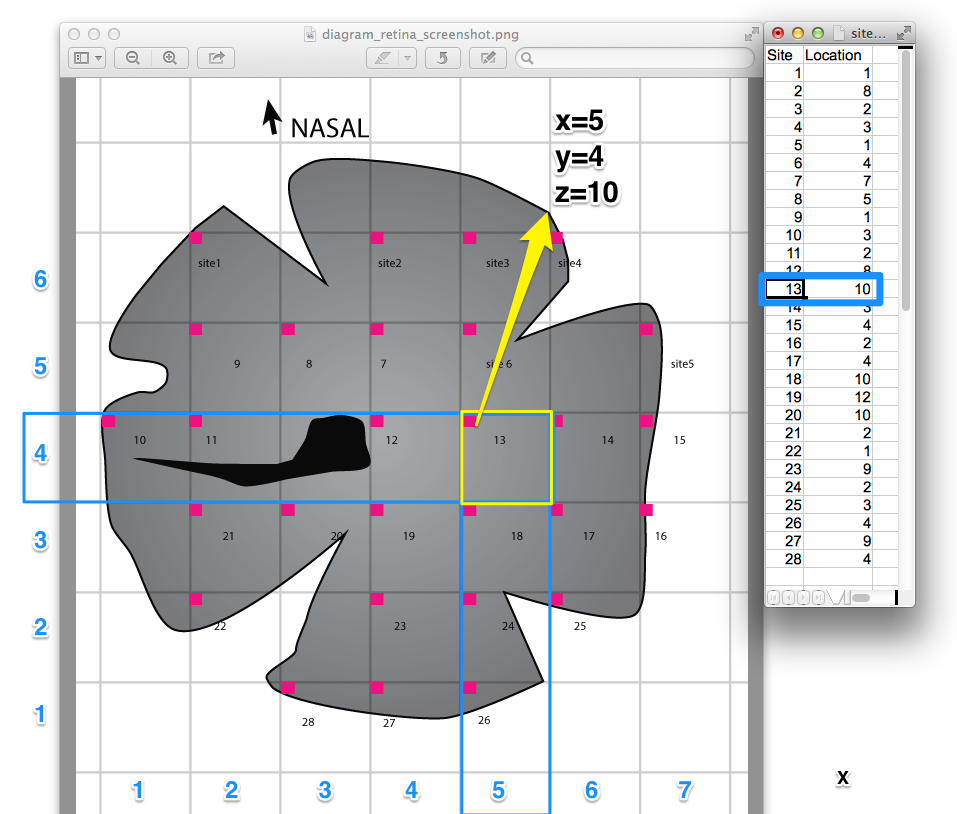
>**Example 1 (above)** Sampling location 13 is at the location `x=5`, `y=4`, because the sampling location is in the top left center of the box in the 4th row, at the 1st column. The `site_counts_from_stereology.csv` shows us that `z=10`.  

>**Example 2** Sampling location 5 is at (7,5). The sampling file says there's 3 cells at location 5. The row in xyz.csv for this sampling location would be `x=7`,`y=5`,`z=3`.  

The origin `(1,1)` is the bottom left corner of the grid, where `x` is the column (vertical), and `y` is the row (horizontal).  
You should finish filling out a three column csv, with the three columns named (without quotes) "x" "y" "z" . Number of rows (excluding the header) will be equal to the number of sampling locations.  
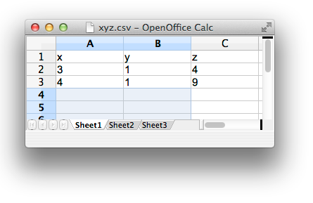

Save this as `xyz.csv` in the 'diagram_retina' folder.

##3. Use ImageJ to record outline vertices and calibrate datapoints.
Install [ImageJ](http://imagej.nih.gov/ij/download.html "Download link") (for PC/Mac/Linux.  
Open `diagram_retina_screenshot.png`

###Trace the retinal outline to make an outline.ROI file
The file name has to be outline.roi, otherwise the program will note that 'No valid dataset is detected'.
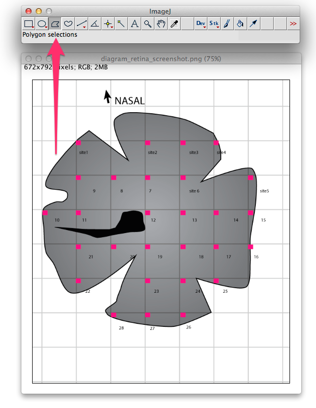  
Select the polygon selection tool  
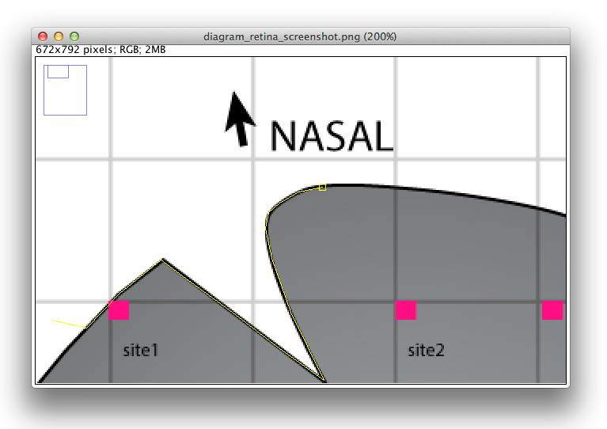  

Click to add connected points along the retinal outline, being extra careful with the incision slits. You can come back to this step in the workflow and improve the accuracy of the outline later.  


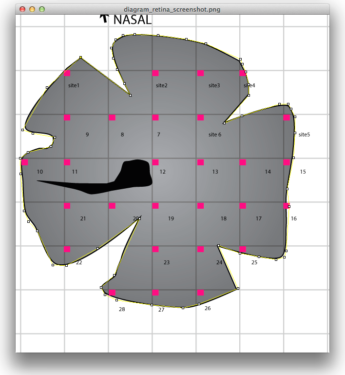  

Come full circle back to the point your started with, and it should change colors to indicate that you're all finished with polygon drawing.

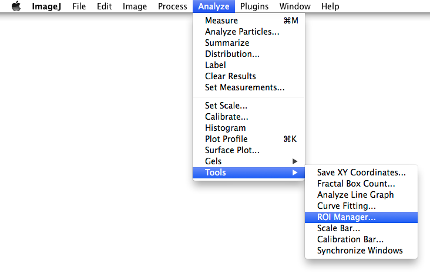  
From the menubar, select Analyze, Tools, ROI Manager. A window will pop up with some buttons. Press the "Add [t]" button.

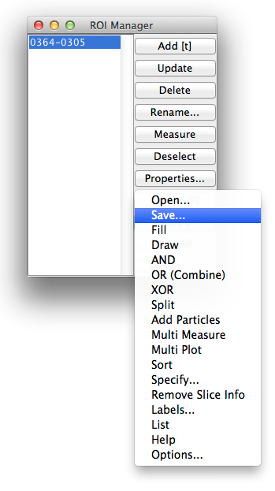  
Next, press the More button. Select "Save"
save it as `outline.ROI` in the `/diagram_retina` folder.
Fresh slate: Close the image, exit ImageJ, start ImageJ again, and open `diagram_retina_screenshot.png`.

###Outline the falciform process
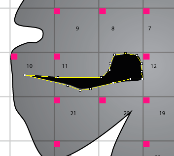  

This time, use the same polygon tool to make an outline of just the falciform process/optic disk (the entire black shape in the middle of the retina).

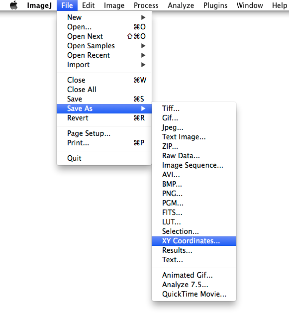  
Once you've drawn the outline, **Don't save the falciform as .ROI.**.  
Choose File > Save As > XY Coordinates... 
Save as `falc.txt` to the `/diagram_retina` folder. 

###Record the ImageJ coordinates of the sampling location bounds
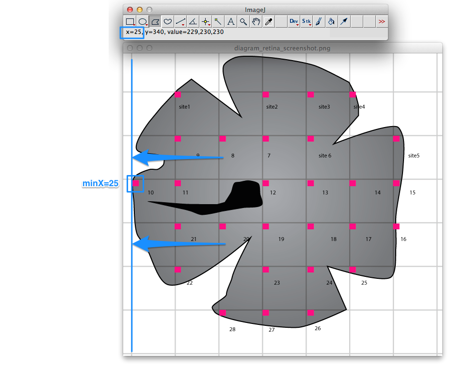  
Find the coordinates of the outermost sampling locations. Hover with your mouse and look at the live-updated (x,y) coordinates in the tool bar.  
**minX Example** Sampling location 10 is the furthest point to the left, and it's at `x=25`.  
**maxX Example** Sampling locations 5, 15, and 16 are on the far right, and share the same edge. They all have `x=566`, so set `maxX` to `566`.  
**deltaX Example** deltaX=6, because there are six vertical lines.
**deltaY Example** deltaX=5, because there are five horizontal lines.
**NOTE** Convert both minY and maxY so they are negative numbers (even though they may look like they're positive in ImageJ.
Write down the minX, maxX, minY, maxY somewhere safe. You'll use it when you call the retina_object function.


```R
# Here are ImageJ coordinates I recorded for a reef fish 
# specimen: http://en.wikipedia.org/wiki/Novaculichthys_taeniourus

IJ<-data.frame(minX   = 42,  		# leftmost counting location's X value 
			   maxX   = 597, 		# rightmost counting location's X value
			   deltaX = (597-42)/17,# average ImageJ pixel distance (in the X axis) between counting locations.
			   minY   = -584, 		# bottommost counting location's Y value
			   maxY   = -32, 		# topmost counting location's Y value
			   deltaY = (584-32)/17 # average ImageJ pixel distance (in the Y axis) between counting locations.
			   ) 
```
Note: If cell counts were collected on the basis of a non-uniform sampling grid, it is still possible to use retina, even though it takes some more effort from the user. Instead of supplying the min and max values of the sampled location, it is necessary to determine the (x, y) pixel location of every single sampling site manually. You can retrieve these location in ImageJ and save the coordinates in *.csv format."

4. Markup the locations of retinal incisions
=====
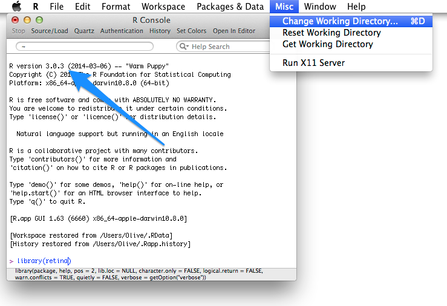  
Open the R Console, load the **retina** package, and set the working directry to the folder enclosing the `diagram_retina` folder. On windows use *File > Change dir*
```R
library(retina)
```

```R
retistruct() #open the retistruct graphic user interface
```
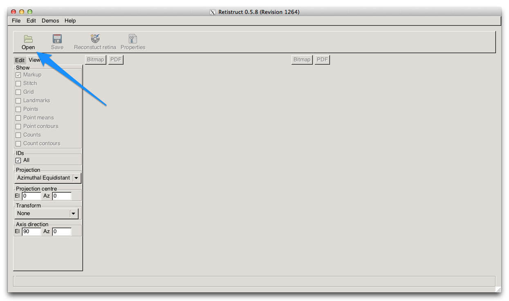  
Press `Open` and navigate to the `diagram_retina` folder on your hard drive.
Ignore this error message: `Scale file does not exist. Scale bar will not be set.`


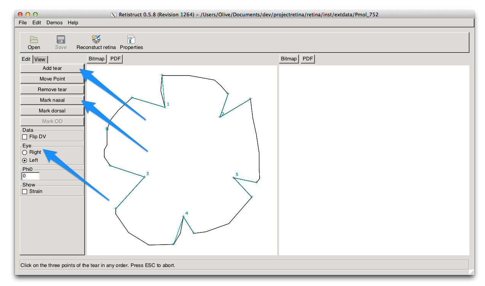  
Instructions for marking up the retina [Sterratt et al 2013]:  
> **Add tear** To add a tear, click on this button, then click on three points in turn which define a tear. The order in which the points are added does not matter. Tears contained within a tear can be marked up, but tears cannot cross over one another.  
**Move Point** To move one of the points defining a tear, click on this button, then click on the point which you desire to move, then click on the point to which it should be moved.  
**Remove tear** To remove a tear, click on this button, then click on the apex of the tear (marked in cyan on the plot)  
**Mark nasal** REQUIRED STEP: To mark the nasal pole, click on this button, then click on the point which is the nasal pole. If the nasal or dorsal pole has already been marked, the marker is removed from the existing location. The nasal pole should not be in a tear. If the nasal tear is placed within a tear, no error is reported at this stage, but it will be reported later.  

####Before continuing, press the **Save** button, and ensure that in your diagram_retina folder the T.csv, and P.csv files have been generated.

###Optional: Adding retinal perimeter latitude for highly non-hemispherical retinae
If you would like to set the Retinal perimeter latitude, paste it into the phi0 box (in units of degrees).
We include the retinal_phi0 function to help users make an approximation of this value with recorded eye measurements.

####Sample calculation
```R
ED = 4.8
AL = 3.43
retinal_phi0(ED, AL)
```

--------------
Begin analysis and visualization with the retina package
=====
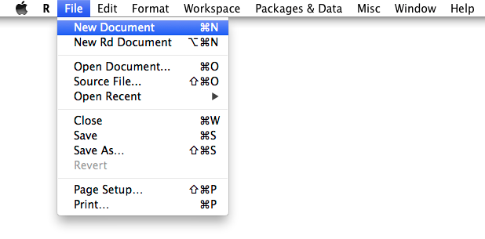  
Create a new R Document, and work with the code snippets below to set up your retinal processing script.

Set the working directory to the folder which contains the *diagram_retina* folder.

Set your parameters
```R
LAMBDA_var <- 0.001 #Thin plate spline smoothing. Lambda=0 would be interpolation.
RESOLUTION_var <- 500 #Plot width in pixels
```

You need to replace these sample numbers with the values you recorded from ImageJ:
```R
IJ <-data.frame(maxX = 1437,
				maxY = -45,
				minX = 469,
				minY = -1029,
				deltaX = 60,
				deltaY = 61)
```

Assemble the retina into a cohesive list object. Eye measurements from dissection are not required for retinal mapping, so if these were not collected or are unavailable, simply put 1.0 for ED, AL, LD.
```R
my_retina <- retina_object(
	path = "diagram_retina",
	
	#Eye Measurements from dissection
		ED = 4.8,    #Eye diameter (mm)
		AL = 3.43,   #Eye axial length (mm)
		LD = 1.8,    #Eye lens diameter (mm)
	
	#Stereology Parameters 
		height = 25 ,# height of the counting frame in microns
		width  = 25, # width of the counting frame in microns
	
	#Plotting Parameters
		lambda = LAMBDA_var,          #see fields::Tps for more information
		extrapolate = TRUE ,          #Predicts densities to the equator.
		spatial_res = RESOLUTION_var,
		rotation_ccw = -90, # when set to -90 degrees, the rotation is unaltered from the measured orientation.
		plot_suppress=TRUE,
	#ImageJ Datapoint Calibration Measurements
		IJcoords = IJ)
```
#Visualization and Diagnostics

```R
retinaplot(my_retina) ##Plot the retina

#Compute the retinal perimeter, to define the width of the plot in mm.
ret_perimeter_len <- semi_ellipse_perimeter(a=ED, b=AL)/2 

#Fit diagnostics
fit_plots(my_retina$fit_data1)
```

How to run your code:
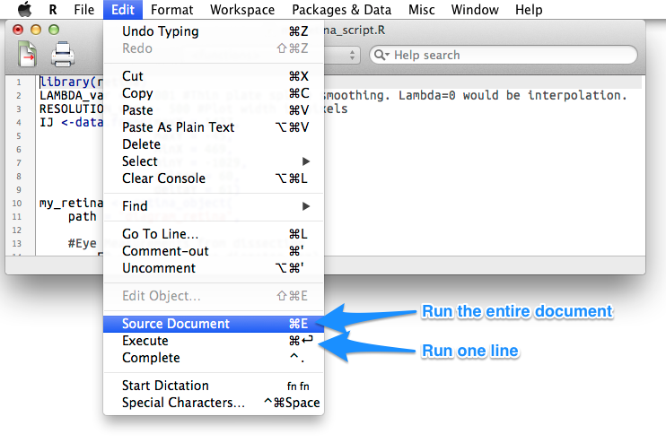  

#Further functionality
```R
?composite_map 				#make an average of 2 maps
?vector_retina_composite 	#make an average of 3+ maps
?polynomial_vs_lambda 		#compare smoothing parameters on your map
```

#Alternative plotting projections:
As *retina* uses mapproj for its projections, our plotter will work with other polar projections, such as azimuthal equal-area, and geometric polar projections. This can be done by modifying the *projection* assignment in the *retina_object* and *mat_from_ret_obj* functions. Importantly, the axis labels will be innacurate, as they are based on the equidistant projection. See the options for alternative projection options in mapproj's CRAN documentation.

#Adding multiple ODs or Falciform Processes in an average map.
The average map (Figure 3D) does not contain a combined optic nerve head or falciform process.
When falciform processes are overlain, they are not all the same size. We did not research the concatenation or smoothing of falciform processes, and thereby exclude this from our manuscript. Users can plot multiple falciform processes atop one another by extracting them from the retinal composite, and plotting the polygons:
```R
#where fc1 is the first retina’s falciform/optic disc coordinates
polygon(fc1[,1], fc1[,2], col=rgb(0, 0, 0,0.5), lty="solid", border="gray42")
polygon(fc2[,1], fc2[,2], col=rgb(0, 0, 0,0.5), lty="solid", border="gray42")
```


#Saving to a paginated PDF
```R
pdf("maps.pdf", width=8.5, height=6)
#Plot retina(s)
dev.off()
```
